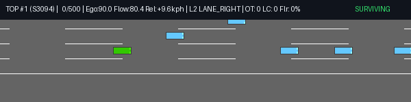
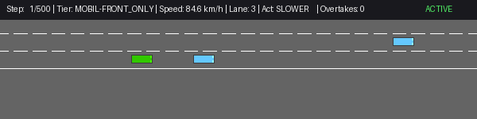

# Sensor-Budgeted Autonomous Highway Driving Benchmark

This repository provides an empirical benchmark evaluating autonomous highway motion planning under sensor-budgeted perception, classical heuristics, reinforcement learning, and constrained safe-RL in [HighwayEnv](https://github.com/Farama-Foundation/HighwayEnv).

## Visual Demonstrations



*Optimal overtaker policy executing dynamic overtaking with anti-aliased lane markings (`STRIPE_SPACING = 30.0` m, `STRIPE_LENGTH = 15.0` m) and telemetry HUD.*



*Under front-only radar perception, the MOBIL heuristic treats unobserved trailing vehicles as absent, resulting in cut-in collisions during lane changes.*

Complete animation suites, MP4 recordings, and the 165-run showcase are cataloged in [visualizations/](visualizations/), [visualizations/top10/](visualizations/top10/), and [gifs/INDEX.md](gifs/INDEX.md).

---

## Empirical Benchmark Results

Evaluations are conducted on the standardized production environment profile:
- **Scenario**: 4-lane highway (`highway-fast-v0`), 14 NPC vehicles, traffic density 1.4, duration 100 s (500 steps/episode)
- **Frequencies**: Policy frequency 5 Hz, simulation frequency 5 Hz ($\Delta t = 0.2$ s)
- **Evaluation Protocol**: 100 fresh, held-out deterministic evaluation seeds (**seeds 4000–4099**) never utilized during training or hyperparameter tuning. Confidence intervals are exact Clopper-Pearson 95% binomial intervals. Two-sided Fisher's exact test p-values ($p_{\text{IDM}}$) are computed against the classical `IDM Only` baseline.

### 1. Safety & Efficiency Metrics

| Policy | Observation Access | Action Speeds (m/s) | Crashes (95% CI) | Crashes / 1000 km | Surviving Speed | All-Episode Speed | Min TTC | Crit TTC (<2s) | $p_{\text{IDM}}$ | Checkpoint Path |
|:---|:---|:---:|:---:|:---:|:---:|:---:|:---:|:---:|:---:|:---|
| **always_SLOWER** | None (Trivial) | [20, 25, 30] | 22/100 [14.3%, 31.4%] | 136.0 | 72.1 km/h | 72.3 km/h | 0.01 s | 0.7% | 1.0000 | Baseline |
| **always_IDLE** | None (Trivial) | [20, 25, 30] | 100/100 [96.4%, 100.0%] | 3081.0 | 90.0 km/h | 90.0 km/h | 0.00 s | 16.2% | <0.0001 | Baseline |
| **Random Action** | None (Random) | [20, 25, 30] | 100/100 [96.4%, 100.0%] | 8065.4 | 88.6 km/h | 88.6 km/h | 0.01 s | 18.8% | <0.0001 | Baseline |
| **IDM Only** | Sensor (Full-ADAS) | Continuous | 22/100 [14.3%, 31.4%] | 128.1 | 76.8 km/h | 75.9 km/h | 0.00 s | 0.7% | — | [baseline_classical.py](baseline_classical.py) |
| **IDM + MOBIL** | Sensor (Full-ADAS) | Continuous | 30/100 [21.2%, 40.0%] | 188.4 | 77.8 km/h | 77.0 km/h | 0.00 s | 0.8% | 0.2590 | [baseline_classical.py](baseline_classical.py) |
| **Feedforward PPO** | Sensor (75-dim Full-ADAS) | [20, 25, 30] | 25/100 [16.9%, 34.7%] | 157.4 | 72.8 km/h | 73.0 km/h | 0.01 s | 0.8% | 0.7390 | [models/ppo_highway_full_adas_seed101.pt](models/ppo_highway_full_adas_seed101.pt) |
| **Optimal Overtaker (Best)** | Privileged Ground Truth (81-dim) | [20, 25, 30] | 10/100 [4.9%, 17.6%] | 53.0 | 74.2 km/h | 74.2 km/h | 0.02 s | 0.2% | 0.0327 | [models/ppo_optimal_overtaker_4lane_best.pt](models/ppo_optimal_overtaker_4lane_best.pt) |
| **Optimal Overtaker (Final)** | Privileged Ground Truth (81-dim) | [20, 25, 30] | 10/100 [4.9%, 17.6%] | 53.0 | 74.2 km/h | 74.2 km/h | 0.02 s | 0.2% | 0.0327 | [models/ppo_optimal_overtaker_4lane.pt](models/ppo_optimal_overtaker_4lane.pt) |
| **PPO-Lagrangian (Sep Norm)** | Privileged Ground Truth (81-dim) | [20, 25, 30] | 48/100 [37.9%, 58.2%] | 407.6 | 73.7 km/h | 80.7 km/h | 0.00 s | 1.6% | 0.0002 | [checkpoints/ppo_lagrangian_sep_norm_best.pt](checkpoints/ppo_lagrangian_sep_norm_best.pt) |
| **DeepSet v2 (2M)** | Sensor Set (74-dim Full-ADAS) | [20, 25, 30] | 0/100 [0.0%, 3.6%] | 0.0 | 71.3 km/h | 71.3 km/h | 2.31 s | 0.0% | <0.0001 | [checkpoints/deepset_v2_highway_2m_best.pt](checkpoints/deepset_v2_highway_2m_best.pt) |
| **Optimal Overtaker (Seed 42)** | Privileged Ground Truth (81-dim) | [10, 15, 20, 25, 30] | 1/100 [0.0%, 5.5%] | 4.9 | 73.9 km/h | 73.9 km/h | 0.09 s | 0.1% | <0.0001 | [checkpoints/optimal_overtaker_extended_speeds_best.pt](checkpoints/optimal_overtaker_extended_speeds_best.pt) |
| **Optimal Overtaker (Seed 137)** | Privileged Ground Truth (81-dim) | [10, 15, 20, 25, 30] | 5/100 [1.6%, 11.3%] | 25.5 | 75.0 km/h | 75.2 km/h | 0.00 s | 0.2% | 0.0007 | [checkpoints/optimal_overtaker_extended_speeds_seed137_best.pt](checkpoints/optimal_overtaker_extended_speeds_seed137_best.pt) |

*Full evaluation telemetry saved to [eval_out/av_benchmark_heldout_seeds4000.json](eval_out/av_benchmark_heldout_seeds4000.json).*

---

### 2. Comfort & Motion Smoothness Metrics

| Policy | RMS Longitudinal Accel | RMS Jerk | Hard-Braking Events ($a < -3\text{ m/s}^2$) / 100 km | Lane Changes / 100 km | Rapid Reversals ($\le 2\text{ s}$) | Action Switch Rate |
|:---|:---:|:---:|:---:|:---:|:---:|:---:|
| **always_SLOWER** | 0.72 m/s² | 1.21 m/s³ | 185.5 | 0.0 | 0.0% | 0.0% |
| **always_IDLE** | 0.00 m/s² | 0.00 m/s³ | 0.0 | 0.0 | 0.0% | 0.0% |
| **Random Action** | 5.10 m/s² | 28.78 m/s³ | 5363.5 | 2766.4 | 35.3% | 82.0% |
| **IDM Only** | 2.93 m/s² | 16.28 m/s³ | 4400.2 | 0.0 | 0.0% | 36.2% |
| **IDM + MOBIL** | 3.23 m/s² | 17.85 m/s³ | 4770.8 | 223.5 | 29.2% | 39.6% |
| **Feedforward PPO** | 1.25 m/s² | 6.12 m/s³ | 861.2 | 0.0 | 0.0% | 6.1% |
| **Optimal Overtaker (Best)** | 1.62 m/s² | 9.54 m/s³ | 1069.1 | 98.5 | 4.8% | 10.6% |
| **Optimal Overtaker (Final)** | 1.62 m/s² | 9.54 m/s³ | 1069.1 | 98.5 | 4.8% | 10.6% |
| **PPO-Lagrangian (Sep Norm)** | 0.57 m/s² | 2.30 m/s³ | 160.5 | 152.0 | 5.0% | 1.1% |
| **DeepSet v2 (2M)** | 7.06 m/s² | 22.51 m/s³ | 9708.4 | 79.8 | 0.0% | 15.0% |
| **Optimal Overtaker (Seed 42)** | 5.69 m/s² | 16.89 m/s³ | 5861.8 | 280.1 | 20.6% | 9.5% |
| **Optimal Overtaker (Seed 137)** | 6.13 m/s² | 18.32 m/s³ | 6978.4 | 5179.4 | 71.1% | 27.8% |

---

## Core Empirical Findings

### 1. Velocity Floor and Baseline Parity
Under HighwayEnv's standard `DiscreteMetaAction`, target speeds are quantized to $[20, 25, 30]$ m/s (minimum speed 72.0 km/h). In density 1.4 traffic, vehicle queues drop lead speeds to 6–15 m/s on 28.2% of simulation steps. Because in-lane braking below 20 m/s is kinematically impossible:
- A trivial deceleration policy (`always_SLOWER`) achieves 22/100 crashes (136.0 crashes/1000km, 72.1 km/h).
- In-lane car-following (`IDM Only`) achieves 22/100 crashes (128.1 crashes/1000km, 76.8 km/h).
- Standard feedforward RL (`Feedforward PPO`, 75-dim) converges to in-lane braking with 0.0 lane changes and achieves 25/100 crashes (157.4 crashes/1000km, 72.8 km/h).
- Under two-sided Fisher's exact tests, `Feedforward PPO` ($p = 0.7390$) and `always_SLOWER` ($p = 1.0000$) are statistically indistinguishable from `IDM Only`.

### 2. Observation Privilege vs Sensor Budgeting
- **Optimal Overtaker** (`models/ppo_optimal_overtaker_4lane_best.pt`): Utilizes `TacticalLaneObservationWrapper`, directly reading simulator arrays (`unwrapped.road.vehicles`) to construct adjacent lane slot gaps (privileged ground truth, unbudgeted).
- **Round-1 PPO & PPO-LSTM** (`models/`): Operate strictly on radar sensor matrices (`front_only` radar: 50 dims; `full_adas` surround radar: 75 dims).
- **DeepSet v2** (`deepset_v2/`): Ingests variable-sized detection sets ($N \times 5$) through a permutation-invariant encoder, operating under the sensor budget without simulator ground-truth slot arrays.

### 3. Action Space Widening and Training Seed Sensitivity
Extending target speeds to $[10, 15, 20, 25, 30]$ m/s allows policies to decelerate below 20 m/s to match slow queues. However, learned lateral policies exhibit high variance across training seeds:
- **Seed 42** converges to deliberate gap-seeking: 1/100 crashes (4.9 crashes/1000km), 280.1 lane changes/100km, and 20.6% rapid reversals.
- **Seed 137** converges to severe lateral hunting: 5/100 crashes on held-out seeds (7/100 on diagnostic seeds), 5,179.4 lane changes/100km, and a 71.1% rapid reversal rate, demonstrating high sensitivity to training seed initialization.

### 4. Safe-RL Constraint Evaluation (PPO-Lagrangian)
Under safety-constrained training ($\text{budget } \kappa = 0.05$ / 5.0% crash limit):
- PPO-Lagrangian achieved a 48/100 crash rate ($J_C = 0.48$) on held-out seeds and 34/100 on diagnostic seeds.
- The dual multiplier oscillated, and the policy failed to satisfy its constraint budget ($p = 0.0002$ vs IDM Only).
- Mean pre-crash ego speed reached 80.7 km/h, underperforming the unconstrained overtaker baseline on safety.

---

## Historical Diagnostic Benchmarks (Seeds 2000–2099)

For continuity with diagnostic analysis runs:

| Policy | Environment Profile | Episodes | Crashes (95% CI) | Mean Speed | Reference Artifact |
|:---|:---|:---:|:---:|:---:|:---|
| **IDM Only** | Current (14 veh, dens 1.4) | 100 | 11/100 [5.6%, 18.8%] | 76.2 km/h | [eval_out/classical_baselines_current.json](eval_out/classical_baselines_current.json) |
| **IDM + MOBIL** | Current (14 veh, dens 1.4) | 100 | 16/100 [9.4%, 24.7%] | 77.3 km/h | [eval_out/classical_baselines_current.json](eval_out/classical_baselines_current.json) |
| **always_SLOWER** | Current (14 veh, dens 1.4) | 100 | 12/100 [6.4%, 20.0%] | 71.8 km/h | [parity/report.md](parity/report.md) |
| **Feedforward PPO (75-dim)** | Current (14 veh, dens 1.4) | 100 | 12/100 [6.4%, 20.0%] | 72.7 km/h | [eval_out/learned_policy_evals_current.json](eval_out/learned_policy_evals_current.json) |
| **Optimal Overtaker** | Current (14 veh, dens 1.4) | 100 | 10/100 [4.9%, 17.6%] | 73.6 km/h | [eval_out/crash_breakdown_optimal_overtaker.json](eval_out/crash_breakdown_optimal_overtaker.json) |
| **PPO-Lagrangian** | Current (14 veh, dens 1.4) | 100 | 34/100 [24.8%, 44.2%] | 78.4 km/h | [eval_out/crash_breakdown_ppo_lagrangian_sep_norm.json](eval_out/crash_breakdown_ppo_lagrangian_sep_norm.json) |
| **DeepSet v2 (2M)** | Current (14 veh, dens 1.4) | 100 | 27/100 [18.6%, 36.8%] | 72.6 km/h | [eval_out/crash_breakdown_2m_seeds2000.json](eval_out/crash_breakdown_2m_seeds2000.json) |
| **Optimal Overtaker (Ext. Spd, Seed 42)** | Current (14 veh, dens 1.4) | 100 | 0/100 [0.0%, 3.6%] | 73.5 km/h | [eval_out/crash_breakdown_optimal_overtaker_extended_speeds.json](eval_out/crash_breakdown_optimal_overtaker_extended_speeds.json) |
| **Optimal Overtaker (Ext. Spd, Seed 137)** | Current (14 veh, dens 1.4) | 100 | 7/100 [2.9%, 13.8%] | 74.9 km/h | [eval_out/crash_breakdown_optimal_overtaker_seed137_best.json](eval_out/crash_breakdown_optimal_overtaker_seed137_best.json) |

*Legacy 40-second profile (10 vehicles, density 1.0, 50-dim input): `Feedforward PPO (front_only)` achieved 2/100 crashes (74.2 km/h); `PPO-LSTM (front_only)` achieved 1/100 crashes (72.5 km/h); the 50-dim `PPO-LSTM (full_adas)` checkpoint collapsed during training and crashed on 100/100 episodes ([eval_out/learned_policy_evals_legacy.json](eval_out/learned_policy_evals_legacy.json)).*

---

## Repository Structure

| Path | Description |
|:---|:---|
| [models/](models/) | Pre-trained PyTorch checkpoints for baseline PPO and Optimal Overtaker models |
| [checkpoints/](checkpoints/) | Tracked model checkpoints for DeepSet v2, PPO-Lagrangian, and Extended-Speed runs |
| [deepset_v2/](deepset_v2/) | Permutation-invariant vehicle set observation wrapper, model architecture, and tests |
| [eval_out/](eval_out/) | Raw empirical evaluation JSON telemetry and crash breakdowns |
| [scripts/](scripts/) | Evaluation harnesses, diagnostics, anti-aliased rendering utilities, and speed benchmarks |
| [tests/](tests/) | Test suite verifying observation bounds, reward invariants, model hashes, and render utilities |
| [visualizations/](visualizations/) | Recorded MP4 telemetry videos and animated GIFs |
| [gifs/](gifs/) | 165-run anti-aliased visual demonstration catalog and index |
| [baseline_classical.py](baseline_classical.py) | Implementation of IDM car-following and MOBIL lane-change heuristics |
| [env_config.py](env_config.py) | Scenario configurations, sensor tier filtering, and tactical observation wrappers |
| [train_optimal_overtaker.py](train_optimal_overtaker.py) | Training pipeline for tactical overtaker policies and PPO-Lagrangian |

---

## Setup & Reproduction

Dependency installation requires Python 3.12+ (due to numpy 2.5.2 constraints):

```bash
python3.12 -m venv .venv
source .venv/bin/activate
pip install -r requirements.txt
```

### Reproducing Benchmark Metrics

Run the comprehensive AV and safe-RL empirical evaluation across all 12 policy configurations on held-out seeds (4000–4099):
```bash
python scripts/evaluate_av_metrics.py --episodes 100 --seed-start 4000 --workers 8
```

Run test suite:
```bash
pytest tests/deepset_v2/test_deepset_v2.py
pytest tests/test_render_utils.py
```

---

