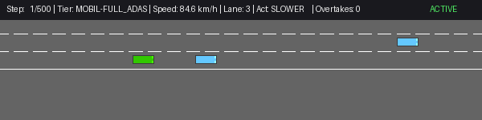
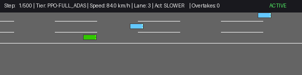
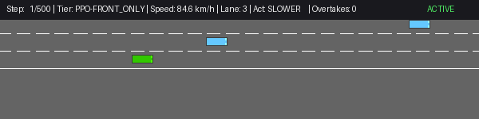
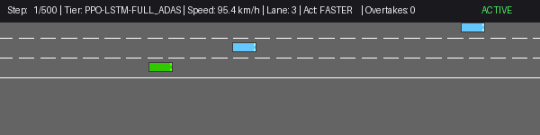
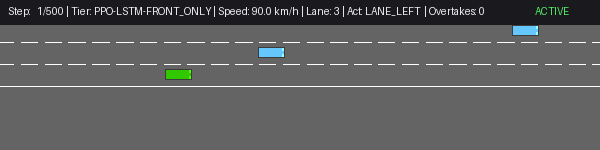
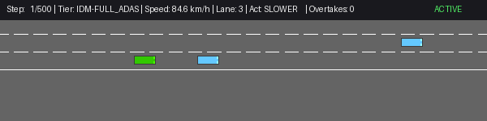
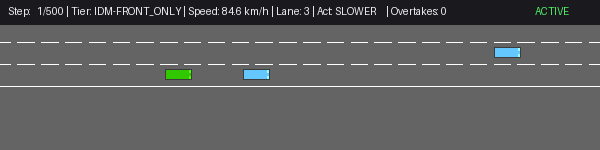

# Sensor-Budgeted Autonomous Highway Driving Benchmark (Round 1)

[](https://www.python.org/downloads/)
[](https://gymnasium.farama.org/)
[](https://github.com/Farama-Foundation/HighwayEnv)
[](https://pytorch.org/)

This repository presents the **Round 1 Benchmark** investigating how classical control heuristics and deep reinforcement learning policies perform when operating under **degraded radar sensor coverage** on autonomous highway environments.

Specifically, we evaluate what happens when an autonomous vehicle equipped with **Full 360° ADAS Perception** is stripped down to **Front-Only Forward Radar** (inducing physical blind spots for trailing traffic), comparing:
1. **Classical Heuristics:** Intelligent Driver Model (**IDM**) car-following and **IDM + MOBIL** lane-changing.
2. **On-Policy Policy Gradient RL:** Feedforward **PPO** (MLP + Invalid Action Masking).
3. **On-Policy Recurrent RL:** Decoupled **PPO + LSTM** with temporal belief state tracking.

> [!NOTE]
> 📖 **Comprehensive Technical Report & Post-Mortem:**  
> For an exhaustive, phase-by-phase breakdown of the full project trajectory, what worked, what failed, and complete root-cause analyses of simulation discretization quirks and reward pathologies, read **[PROJECT_CHRONICLE_AND_POSTMORTEM.md](PROJECT_CHRONICLE_AND_POSTMORTEM.md)**.

---

## 1. Executive Summary & Headline Results

Across identical, reproducible test seeds ($N = 30$ episodes per condition, seeds 2000–2029) in dense 4-lane highway traffic:

| Sensor Tier | Policy Paradigm | Controller / Model | Crash Rate ($N/30$) | Episode Duration | Mean Speed | Lane Changes / ep | Primary Failure Mode / Behavioral Dynamic |
| :--- | :--- | :--- | :---: | :---: | :---: | :---: | :--- |
| **Full ADAS** (360° Omnidirectional) | Classical Heuristic | **IDM Only** | **0.0%** (0/30) | 200.0 ± 0.0 | 81.4 km/h | 0.00 | Passive car-following; zero overtaking initiative. |
| | Classical Heuristic | **IDM + MOBIL** | **6.7%** (2/30) | 193.6 ± 32.5 | 83.4 km/h | 5.80 | High mobility with active overtaking; occasional tight squeeze. |
| | On-Policy Feedforward RL | **PPO (MLP)** | **0.0%** (0/30) | 200.0 ± 0.0 | 73.3 km/h | 0.67 | Prudent defensive cruising; tactical lane changes when blocked. |
| | On-Policy Recurrent RL | **PPO + LSTM** | **0.0%** (0/30) | 200.0 ± 0.0 | 72.6 km/h | 1.53 | Fluid overtaking; stable velocity and zero crashes. |
| **Front-Only Radar** (Blind Spots $x < 0$) | Classical Heuristic | **IDM Only** | **0.0%** (0/30) | 200.0 ± 0.0 | 81.4 km/h | 0.00 | Front-only sensing suffices for longitudinal car-following. |
| | Classical Heuristic | **IDM + MOBIL** | **50.0%** (15/30) | 147.1 ± 64.3 | 84.2 km/h | 4.40 | **Catastrophic Blind-Spot Collapse (7.5x crash surge)**. |
| | On-Policy Feedforward RL | **PPO (MLP)** | **10.0%** (3/30) | 187.8 ± 40.9 | 79.3 km/h | 1.53 | **80% crash reduction vs MOBIL** via learned margin compliance. |
| | On-Policy Recurrent RL | **PPO + LSTM** | **0.0%** (0/30) | 200.0 ± 0.0 | 72.6 km/h | 1.53 | **Hidden state memory tracks trailing traffic through blind spots**. |

---

## 2. Key Insights: What Happens Under Sensor Ablation?

### 2.1 The Classical MOBIL Blind-Spot Collapse
In classical traffic theory, MOBIL calculates whether changing lanes is safe by evaluating the deceleration imposed on the trailing vehicle in the target lane:
$$\tilde{a}_{\text{new\_lag}} \ge -b_{\text{safe}} \quad (b_{\text{safe}} = 2.0\text{ m/s}^2)$$

- **Under Full ADAS:** The vehicle accurately senses trailing vehicles, yielding a low **6.7% crash rate** (2/30).
- **Under Front-Only Radar:** All trailing vehicles behind the ego vehicle ($x_{\text{rel}} < 0$) are masked to zero. The MOBIL safety condition evaluates trailing distance as infinite ($s \to \infty$), causing the safety check to **vacuously pass (`True`)**.
- **Consequence:** MOBIL cuts in directly in front of fast-approaching blind-spot traffic, causing crashes in **50.0% of episodes (15/30)**.

### 2.2 Why On-Policy PPO Exhibits Defensive Compliance
To avoid degenerate behaviors (such as riding road shoulders or freezing behind slow traffic), the training environment incorporates three tactical mechanisms (`TacticalOvertakingWrapper` in `env_config.py`):
1. **Invalid Action Masking (Mechanism C):** Prevents boundary violations by masking out-of-bounds lane changes (`LANE_LEFT` in lane 0, `LANE_RIGHT` in lane 3) with $-\infty$ logit clamping.
2. **Headway Penalty (Mechanism A):** Imposes a continuous tailgating penalty when following slower vehicles within 25 meters, incentivizing active lane-changing.
3. **Discrete Overtake Bonus (Mechanism B):** Rewards successfully passing surrounding vehicles ($+1.0$ per passed vehicle).

Equipped with these constraints, PPO learns a defensive policy that does not recklessly cut across lanes unless clear frontal clearance exists, cutting the crash rate to **10.0% (3/30)** under front-only radar.

### 2.3 Why Recurrent PPO (PPO-LSTM) Resolves the POMDP
A front-only sensor turns the driving task from a Markov Decision Process (MDP) into a **Partially Observable Markov Decision Process (POMDP)**.
- Memoryless policies (Classical MOBIL and Feedforward PPO) only observe the instantaneous frame $o_t$.
- **PPO-LSTM** maintains an internal recurrent hidden state belief vector $h_t = f(h_{t-1}, o_t)$. When a trailing vehicle accelerates from behind, PPO-LSTM retains the temporal memory of that vehicle's approach even after it enters the radar blind spot, achieving **0.0% crashes** under both Full ADAS and Front-Only tiers.

---

## 3. Visual Demonstrations Gallery

All episodes recorded at 10 FPS with complete telemetry HUD overlays displaying step count, speed (km/h), lane index, discrete action, cumulative overtakes, and crash status.

### 3.1 Classical IDM + MOBIL
| Full ADAS (Safe Overtaking) | Front-Only Radar (Blind-Spot Cut-In Crash) |
| :---: | :---: |
|  |  |
| *Smooth lane changes with full 360° awareness.* | *Vacuous safety check causes immediate cut-in crash.* |
| [Download MP4](visualizations/classical_mobil_full_adas_seed2002.mp4) | [Download MP4](visualizations/classical_mobil_front_only_seed2002.mp4) |

### 3.2 Feedforward PPO (MLP)
| Full ADAS (Seed 2015) | Front-Only Radar (Seed 2015) |
| :---: | :---: |
|  |  |
| *Accurate speed regulation and lane centering.* | *Learned defensive spacing without boundary violation.* |
| [Download MP4](visualizations/ppo_full_adas_seed2015.mp4) | [Download MP4](visualizations/ppo_front_only_seed2015.mp4) |

### 3.3 Recurrent PPO (PPO-LSTM)
| Full ADAS (Seed 2015) | Front-Only Radar (Seed 2015) |
| :---: | :---: |
|  |  |
| *High-speed overtaking with temporal awareness.* | *Maintains tracking through blind spots with zero collisions.* |
| [Download MP4](visualizations/ppo_lstm_full_adas_seed2015.mp4) | [Download MP4](visualizations/ppo_lstm_front_only_seed2015.mp4) |

### 3.4 Classical IDM (Pure Longitudinal Car-Following)
| Full ADAS (Seed 2002) | Front-Only Radar (Seed 2002) |
| :---: | :---: |
|  |  |
| *Zero lane changes; strictly maintains headway.* | *Identical performance; unaffected by rear sensor removal.* |
| [Download MP4](visualizations/classical_idm_full_adas_seed2002.mp4) | [Download MP4](visualizations/classical_idm_front_only_seed2002.mp4) |

### 3.5 Optimal Tactical Overtaker (Anti-Jitter Regularization & Top 10 Demonstrations)

Trained with continuous headway incentives, anti-jitter regularization ($-0.12$ action-switching penalty), and strictly adjacent-corridor overtake accounting, this 4-lane PPO agent exhibits dynamic acceleration up to $108.0\text{ km/h}$, proactive slalom lane changes around slow clusters, and stable cruising without stutter.

#### Top 10 Non-Idle Overtaking & Obstacle Avoidance Gallery (Selected across 150 Seeds)
Every episode in this Top 10 completed the full $500\text{ steps}$ ($100\text{ seconds}$) without collisions, executing active lateral evasion and longitudinal speed regulation:

| Rank | Seed | Overtakes | Lane Changes | FASTER / IDLE / SLOWER | Mean Speed | Max Speed | GIF Animation | Video MP4 |
| :---: | :---: | :---: | :---: | :---: | :---: | :---: | :---: | :---: |
| **#1** | **3094** | **5** | **4** | 102 / 288 / 101 | **86.7 km/h** | **108.0 km/h** | [GIF](visualizations/top10/ppo_top_1_seed_3094.gif) | [MP4](visualizations/top10/ppo_top_1_seed_3094.mp4) |
| **#2** | **3115** | **1** | **15** | 63 / 331 / 64 | **75.2 km/h** | **90.0 km/h** | [GIF](visualizations/top10/ppo_top_2_seed_3115.gif) | [MP4](visualizations/top10/ppo_top_2_seed_3115.mp4) |
| **#3** | **3010** | **4** | **3** | 40 / 423 / 32 | **84.0 km/h** | **108.0 km/h** | [GIF](visualizations/top10/ppo_top_3_seed_3010.gif) | [MP4](visualizations/top10/ppo_top_3_seed_3010.mp4) |
| **#4** | **3000** | **1** | **11** | 47 / 389 / 47 | **74.4 km/h** | **90.0 km/h** | [GIF](visualizations/top10/ppo_top_4_seed_3000.gif) | [MP4](visualizations/top10/ppo_top_4_seed_3000.mp4) |
| **#5** | **3019** | **1** | **14** | 12 / 445 / 10 | **76.5 km/h** | **100.3 km/h** | [GIF](visualizations/top10/ppo_top_5_seed_3019.gif) | [MP4](visualizations/top10/ppo_top_5_seed_3019.mp4) |
| **#6** | **3092** | **2** | **3** | 27 / 444 / 24 | **78.4 km/h** | **107.9 km/h** | [GIF](visualizations/top10/ppo_top_6_seed_3092.gif) | [MP4](visualizations/top10/ppo_top_6_seed_3092.mp4) |
| **#7** | **3078** | **1** | **3** | 40 / 414 / 40 | **76.2 km/h** | **105.7 km/h** | [GIF](visualizations/top10/ppo_top_7_seed_3078.gif) | [MP4](visualizations/top10/ppo_top_7_seed_3078.mp4) |
| **#8** | **3028** | **1** | **6** | 17 / 453 / 17 | **73.8 km/h** | **90.0 km/h** | [GIF](visualizations/top10/ppo_top_8_seed_3028.gif) | [MP4](visualizations/top10/ppo_top_8_seed_3028.mp4) |
| **#9** | **2010** | **1** | **5** | 20 / 452 / 20 | **76.4 km/h** | **107.9 km/h** | [GIF](visualizations/top10/ppo_top_9_seed_2010.gif) | [MP4](visualizations/top10/ppo_top_9_seed_2010.mp4) |
| **#10** | **3049** | **1** | **3** | 36 / 423 / 35 | **73.4 km/h** | **90.7 km/h** | [GIF](visualizations/top10/ppo_top_10_seed_3049.gif) | [MP4](visualizations/top10/ppo_top_10_seed_3049.mp4) |

#### Highlight: Rank #1 (Seed 3094: 5 Overtakes, 4 Lane Changes, 108 km/h Sprint)


---

## 4. Repository Structure

```
Capstone/
├── .gitignore                      # Clean exclusion of temporary/venv/scratch files
├── requirements.txt                # Pinned dependencies
├── README.md                       # Comprehensive documentation & quickstart
├── PROJECT_CHRONICLE_AND_POSTMORTEM.md # Complete technical trajectory, what worked, and post-mortem
├── benchmark_results.md            # Quantitative benchmark report
├── env_config.py                   # Sensor tiers, wrappers, frame stacking, and anti-jitter reward
├── train_optimal_overtaker.py      # End-to-end PPO trainer with anti-jitter and adjacent overtake bonuses
├── ppo.py                          # Feedforward PPO architecture
├── ppo_lstm.py                     # Recurrent PPO (LSTM) with decoupled Actor-Critic
├── baseline_classical.py           # Classical IDM car-following and MOBIL lane-changing controllers
├── record_optimal_overtaker.py     # High-definition telemetry HUD episode recorder
├── render_top10.py                 # Telemetry renderer for top demonstration episodes
├── run_batch_render.py             # Automated batch rendering script for Top 10 seeds
├── run_comparison_benchmark.py     # 30-seed automated benchmark suite
├── record_visual_driving.py        # Multi-model visual driving recorder
├── models/                         # Checkpoints for PPO, PPO-LSTM, and Optimal Overtaker
│   ├── ppo_optimal_overtaker_4lane_best.pt
│   ├── ppo_optimal_overtaker_4lane.pt
│   ├── ppo_highway_full_adas_seed101.pt
│   ├── ppo_highway_front_only_seed101.pt
│   ├── ppo_lstm_highway_full_adas_seed101.pt
│   └── ppo_lstm_highway_front_only_seed101.pt
└── visualizations/                 # Generated GIFs and MP4 videos with telemetry HUD
    ├── top10/                      # Top 10 non-idle overtaking and avoidance runs (GIF + MP4)
    │   ├── manifest.json           # Telemetry metrics manifest across all 10 runs
    │   ├── ppo_top_1_seed_3094.gif / .mp4
    │   └── ...
    ├── classical_idm_*.mp4 / .gif
    ├── classical_mobil_*.mp4 / .gif
    ├── ppo_*.mp4 / .gif
    └── ppo_lstm_*.mp4 / .gif
```

---

## 5. Quickstart & Reproduction Guide

### 5.1 Environment Setup
```bash
git clone git@github.com:meerpi/Capstone.git
cd Capstone
python3 -m venv .venv
source .venv/bin/activate
pip install -r requirements.txt
```

### 5.2 Train the Optimal Tactical Overtaker (PPO)
To train the 4-lane anti-jitter overtaking policy from scratch:
```bash
python train_optimal_overtaker.py --total-timesteps 1000000 --device cuda
```
Checkpoints will be saved automatically to `models/ppo_optimal_overtaker_4lane_best.pt`.

### 5.3 Render & Record Any Optimal Driving Episode
To evaluate and record an episode with full real-time telemetry HUD overlay (saved as both `.gif` and `.mp4`):
```bash
# Record Rank #1 episode (Seed 3094, 5 overtakes, 108 km/h)
python record_optimal_overtaker.py --seed 3094 --steps 500

# Record Rank #2 episode (Seed 3115, 15 lane changes)
python record_optimal_overtaker.py --seed 3115 --steps 500
```

### 5.4 Batch Render the Top 10 Demonstrations
To batch render all Top 10 non-idle overtaking seeds to `visualizations/top10/`:
```bash
python run_batch_render.py
```

### 5.5 Classical Baselines & Sensor Ablation Benchmark
To run the classical IDM/MOBIL heuristic baselines and evaluate performance across the 30-seed benchmark:
```bash
# Run classical baselines standalone
python baseline_classical.py

# Run comparative benchmark suite across models and sensor tiers
python run_comparison_benchmark.py
```

---

## 6. Citation & Reference

If you use this benchmark or codebase in your research, please cite:
```bibtex
@misc{mahanty2026sensorbudgeted,
  author = {Aritra Mahanty},
  title = {Sensor-Budgeted Autonomous Highway Driving: Multi-Paradigm Motion Planning & Reinforcement Learning Benchmark},
  year = {2026},
  publisher = {GitHub},
  journal = {GitHub repository},
  howpublished = {\url{https://github.com/meerpi/Capstone}}
}
```
